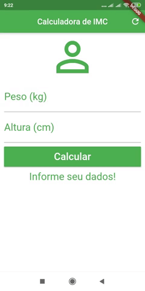

 # Calculadora IMC

Um projeto simples em Flutter para meu aprendizado.

## Entenda seus níveis

| Abaixo do peso | Peso normal | Sobrepeso/pré-obsidade | Obesidade Grau I | Obesidade Grau II | Obesidade Grau III |
|----------------|-------------|------------------------|------------------|-------------------|--------------------|
|      18,5      | 18,6 - 24,9 |      25,0 - 29,9       |   30,0 - 34,9    |    35,0 - 39.9    |   Acima de 40,00   |

Fonte: *http://www.abeso.org.br/atitude-saudavel/imc*

## Clonar repositório

`` git clone https://github.com/thiagosr135/calculadora_imc.git ``

## Autor
* **Thiago de Souza Ribeiro** - [thiagosr135](https://github.com/thiagosr135)
